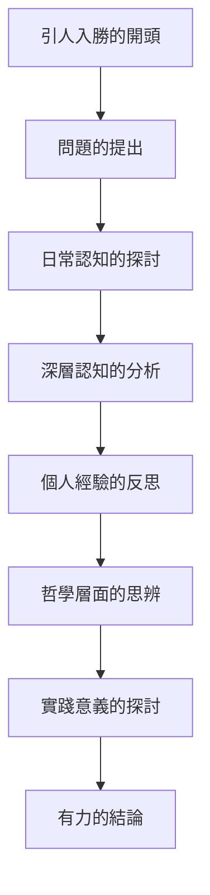
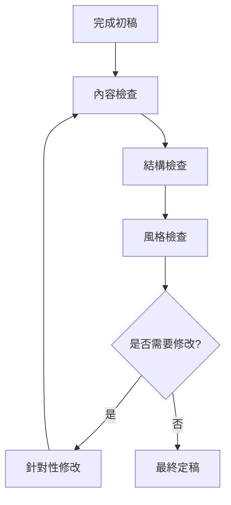
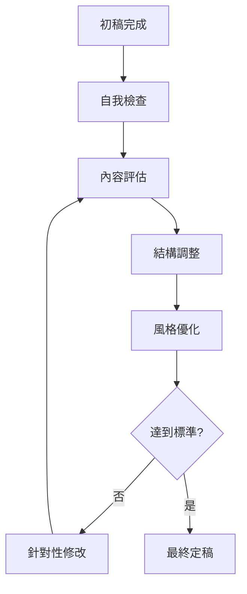

# Design Document

## Overview

「什麼叫知道」是一篇探討認知、理解與知識本質的哲學思辨文章。文章將運用《電馭寫作》七階段流程進行創作，以安德風格的溫暖親切語調，為讀者提供關於「知道」這個根本概念的深入思考和個人洞察。

文章的核心理念是從日常生活的認知經驗出發，逐步深入探討什麼是真正的「知道」，並結合個人反思和哲學思辨，讓讀者對自身的認知方式產生新的理解和思考。

## Architecture

### 文章結構架構

### 核心主題模組

1. **認知層次的探討**
   - 表面認知與深層理解的區別
   - 知識獲得的不同途徑
   - 認知的局限性和可能性

2. **個人經驗的融入**
   - 具體的生活場景和故事
   - 個人的認知轉變經歷
   - 從經驗中提煉的洞察

3. **哲學思辨的深化**
   - 古今中外對「知道」的不同理解
   - 認識論的基本問題
   - 當代認知科學的啟發

4. **實踐價值的體現**
   - 如何改善我們的認知方式
   - 在日常生活中的應用
   - 對個人成長的意義

## Components and Interfaces

### 1. 文章核心組件

#### 開頭設計 (Opening Design)
- **引入方式**: 從一個具體的日常場景開始
- **問題提出**: 自然地引出「什麼叫知道」這個問題
- **讀者共鳴**: 讓讀者產生「我也有過這樣的疑惑」的感受

#### 主體論述 (Main Arguments)
- **層次遞進**: 從淺層認知到深層理解的邏輯展開
- **例證支撐**: 每個觀點都有具體的例子或故事支撐
- **個人反思**: 融入作者的個人經驗和思考過程

#### 結論昇華 (Conclusion Elevation)
- **觀點總結**: 回顧文章的核心洞察
- **實踐指引**: 提供讀者可以應用的思考方式
- **開放結尾**: 留給讀者繼續思考的空間

### 2. 安德風格元素

#### 語言特色 (Language Features)
- **溫暖語調**: 使用親切、溫暖的表達方式
- **生動比喻**: 運用貼近生活的比喻和類比
- **反思句式**: 「對我而言」、「這讓我想到」等個人化表達

#### 內容特色 (Content Features)
- **具體場景**: 描述具體的人、事、物來增加真實感
- **個人經歷**: 分享相關的個人經驗和感悟
- **他人觀點**: 引用他人的想法並加入自己的思考

### 3. 哲學思辨元素

#### 概念分析 (Conceptual Analysis)
- **定義澄清**: 對「知道」這個概念進行多角度分析
- **層次區分**: 區分不同層次和類型的「知道」
- **邊界探討**: 探討認知的邊界和局限

#### 思辨深化 (Philosophical Deepening)
- **古今對話**: 結合古代智慧和現代認知
- **東西融合**: 融合東西方的認知觀點
- **理實結合**: 將抽象思辨與具體實踐結合

## Data Models

### 文章內容模型

#### 文章基本資訊
- **標題**: 「什麼叫知道」（待優化）
- **主題**: 探討認知、理解與知識的本質
- **目標讀者**: 哲學思考者、對認知感興趣的一般讀者
- **預期字數**: 2000-4000字
- **寫作風格**: 安德風格（溫暖親切、深度思考）

#### 核心觀點架構
- **主要論點**: 真正的「知道」不僅是資訊的獲得，更是理解的深化和智慧的體現
- **支撐觀點**: 
  - 表面認知與深層理解的區別
  - 知識獲得的多元途徑
  - 個人經驗在認知中的重要性
  - 認知的局限性和超越可能

#### 內容素材庫
- **個人經驗**: 相關的認知轉變經歷
- **生活場景**: 日常中關於「知道」的具體例子
- **哲學引用**: 相關的哲學家觀點和經典論述
- **現代案例**: 當代認知科學的發現和啟發

#### 安德風格要素
- **語言特色**: 
  - 「對我而言」、「這讓我想到」等反思性表達
  - 生動的比喻和類比
  - 溫暖親切的語調
- **結構特色**:
  - 從個人經驗出發的敘述方式
  - 層層遞進的思考深度
  - 理論與實踐的結合

## Error Handling

### 寫作過程中的挑戰和應對策略

#### 1. 概念表達的挑戰
- **抽象概念具體化**: 使用生活化的例子和比喻來說明複雜的哲學概念
- **避免過於學術化**: 保持安德風格的親切感，避免過於艱深的術語
- **平衡深度與可讀性**: 在思考深度和易讀性之間找到平衡點

#### 2. 結構組織的挑戰
- **邏輯連貫性**: 確保各段落之間有清晰的邏輯關係
- **避免重複**: 防止在不同段落中重複相同的觀點
- **保持焦點**: 避免偏離「什麼叫知道」這個核心主題

#### 3. 風格一致性的挑戰
- **語調統一**: 全文保持安德風格的溫暖親切
- **個人化表達**: 適度融入個人經驗，但不過度自我中心
- **深度與親和力**: 在哲學深度和讀者親和力之間取得平衡

### 品質控制流程

## Testing Strategy

### 文章品質評估策略

#### 1. 內容品質評估
- **主題聚焦度**: 檢查文章是否始終圍繞「什麼叫知道」這個核心主題
- **論證充分性**: 評估每個觀點是否有足夠的例證和論述支撐
- **深度與廣度**: 確保文章既有思考深度又涵蓋足夠的面向
- **原創性**: 檢查是否提供了新的視角和個人洞察

#### 2. 結構邏輯評估
- **開頭吸引力**: 評估開頭是否能夠抓住讀者注意力
- **段落連貫性**: 檢查各段落之間的邏輯關係是否清晰
- **論述層次**: 確保從淺入深的邏輯展開合理
- **結尾有力度**: 評估結論是否令人印象深刻且呼應主題

#### 3. 風格一致性評估
- **安德風格體現**: 檢查是否體現了溫暖親切的語調
- **個人化表達**: 評估反思性語句和個人經驗的運用
- **生動性**: 檢查比喻和具體例子的使用效果
- **可讀性**: 確保哲學內容對一般讀者友善

#### 4. 讀者體驗評估
- **共鳴度**: 評估讀者是否容易產生共鳴
- **啟發性**: 檢查文章是否能引發讀者思考
- **實用性**: 評估讀者是否能從中獲得實際價值
- **記憶點**: 確保文章有令人印象深刻的金句或洞察

### 品質檢查清單

#### 七階段完成度檢查
1. **選題階段**: 主題明確，目標讀者清晰
2. **發想階段**: 有獨特觀點和創新角度
3. **備料階段**: 素材豐富，例證充分
4. **標題階段**: 標題吸引人且準確反映內容
5. **前言階段**: 開頭引人入勝，自然引出主題
6. **主體階段**: 論述清晰，邏輯嚴密
7. **收尾階段**: 結論有力，呼應開頭

#### 最終品質標準
- **字數控制**: 2000-4000字範圍內
- **可讀性**: 適合哲學思考者閱讀
- **完整性**: 涵蓋「什麼叫知道」的多個面向
- **感染力**: 具有安德風格的溫暖感染力

### 修改優化流程

這個設計確保「什麼叫知道」文章能夠達到高品質標準，既有哲學深度又具有安德風格的親和力，為讀者提供有價值的思考和啟發。